# 基于聚类的NIPT时点选择与基于随机森林的胎儿的异常判定模型

## 摘要

在生殖临床和实验中，NIPT（无创产前检测）是判定胎儿健康状况的重要依据。提高NIPT的准确率、并且在早期发现不健康的胎儿，对于临床就诊和治疗具有重要价值。本文建立了基于聚类的NIPT时点选择模型，求解综合考虑其他因素时，多个孕妇的BMI组的最优NIPT时点；同时建立了基于经验阈值的胎儿异常判定模型，判定女胎是否异常。

针对问题1，通过建立多个回归模型比较，最终选用多元二次回归模型。首先进行斯皮尔曼相关性分析，发现X染色体浓度与Y染色体浓度的相关性最高。依次尝试了单元线性回归、多元线性回归、单元二次回归、多元二次回归（以X染色体浓度为二次项）及单元三次回归。结果表明，多元二次回归的决定系数$R^2$最高。

针对问题2，首先绘制孕妇BMI与Y染色体浓度的散点图，观察到数据呈一个紧凑聚类和若干散点分布。先采用朴素分类法将数据分为三组，分别估算各组Y染色体浓度达到最佳NIPT检测窗口（$[0.04,0.1]$）时所对应的孕周。随后建立K-Means聚类模型，将数据划分为$6$组，有效分离了聚类与散点，并计算了各组达到最佳检测浓度时的平均孕周。

针对问题3，建立多维K-Means聚类模型，依据BMI、X染色体浓度、18号染色体Z值及参考基因组比对比例，将孕妇分为六组，并计算各组的最佳NIPT检测孕周。

针对问题4，注意到附录给出的Z值计算公式有特殊含义，说明了Z值在多数据集决策中占有相当权重的分量。采用随机森林模型对女胎染色体异常进行判定。以BMI、X染色体及21、18、13号染色体的Z值与GC含量等作为特征，使用80%的数据训练模型，并在剩余20%的测试集上进行验证，最终获得了90.08%的准确率。

**关键词：多元非线性回归，基于聚类的分组，基于随机森林的判定**

## 1 问题重述

### 1.1 问题背景

无创产前检测（NIPT）是通过分析孕妇血液中胎儿的游离DNA片段，筛查胎儿是否存在染色体异常的关键技术。其检测准确性高度依赖于胎儿性染色体（如男胎的Y染色体）的浓度，而该浓度与孕妇的孕周及身体质量指数（BMI）密切相关。为确保结果可靠，需在合适的孕周进行检测，使得Y染色体浓度达到有效阈值（通常不低于4%）。检测过早可能导致浓度不足而失败，检测过晚则会延误对异常胎儿的干预，显著增加医疗风险。

实践中，通常依据孕妇的BMI进行简单分组并统一确定检测时点，但该方法未能充分考虑个体差异，可能影响检测准确性或延误最佳干预时机。因此，需要建立更精细的数学模型，利用实际检测数据（附件提供了包含多次检测记录及部分测序失败案例的数据），对孕妇进行科学分组，并为不同群体确定个性化的最佳NIPT检测时点，从而在保证检测准确性的前提下，最大限度降低因治疗窗口期缩短所带来的风险。

### 1.2 问题概述

围绕相关约束和条件要求，研究NIPT的时点选择与胎儿的异常判定，依次提出以下问题：

问题1：分析胎儿Y染色体浓度与孕周、BMI等指标的相关性，建立并验证预测模型。

问题2：基于BMI对男胎孕妇进行分组，确定各组最佳NIPT检测时点以最小化风险，并分析检测误差的影响。

问题3：综合考虑多种因素及检测误差，对男胎孕妇重新分组并优化最佳检测时点，以进一步降低潜在风险。

问题4：基于多个染色体指标及BMI等因素，构建女胎染色体异常的判定模型。

## 2 问题1模型的建立与求解

### 2.1 问题分析与描述

问题1探究胎儿Y染色体浓度与孕周、BMI等指标的相关性，首先对各变量与Y染色体浓度进行探索性统计分析，以揭示其内在联系。在此基础上，尝试建立多种回归模型，并通过比较拟合效果，最终选取最优模型进行刻画。

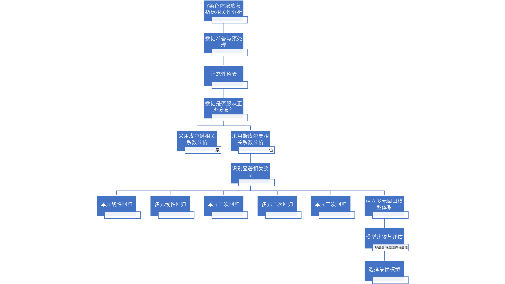

### 2.2 基于多元非线性回归的Y染色体浓度和其他指标的模型的建立

#### 2.2.1 模型预处理

为探究Y染色体浓度与其他连续型数据间的关系，需选用适当的统计相关性分析方法。皮尔逊相关系数适用于两组均服从正态分布且呈线性关系的数据；斯皮尔曼相关系数则仅要求数据间存在单调关系，对分布形态无特定要求[1]。

从Excel从附件.xlsx导出男胎检测数据.csv。鉴于数据分布形态未知，首先进行正态性检验。一方面，可通过绘制各变量的直方图进行初步观察，发现大多数连续变量呈偏态分布。

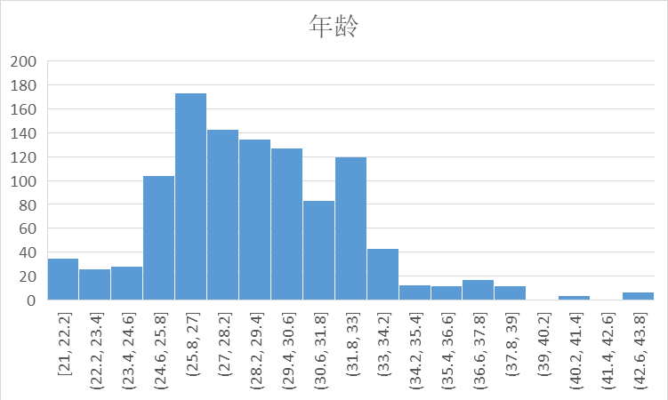

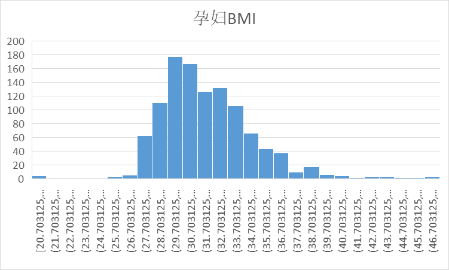

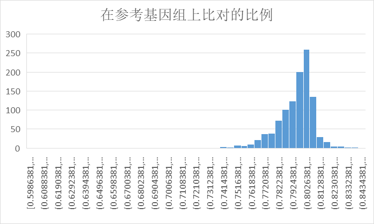

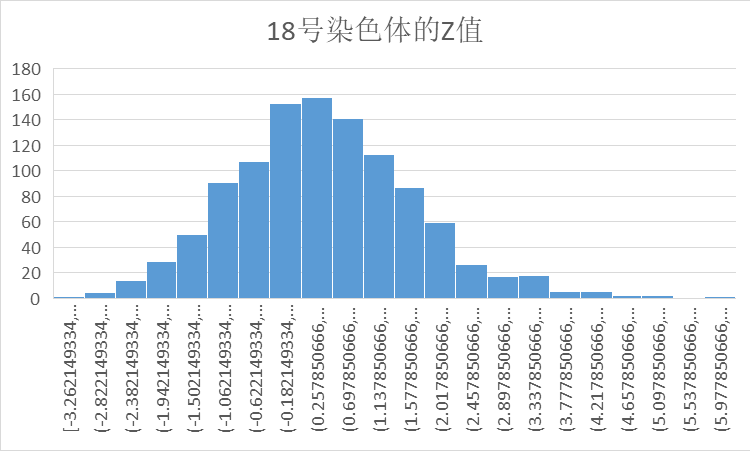

另一方面，采用Shapiro-Wilk正态性检验进行定量判断[2]，若检验$p$值大于$0.05$，则接受数据服从正态分布的原假设。为此，对全部连续变量执行了Shapiro-Wilk正态性检验，结果汇总如下

Shapiro-Wilk正态性检验结果:

年龄,p值:2.2753851220897498e-14,不符合正态分布

身高,p值:1.7340185807241337e-06,不符合正态分布

体重,p值:3.7233937798759795e-16,不符合正态分布

检测孕周,p值:1.6879136003863942e-23,不符合正态分布

孕妇BMI,p值:5.2048297226460026e-20,不符合正态分布

原始读段数,p值:1.1675340446553461e-13,不符合正态分布

在参考基因组上比对的比例,p值:8.335508231652764e-32,不符合正态分布

重复读段的比例,p值:5.502587585464384e-17,不符合正态分布

唯一比对的读段数 ,p值:1.2744417598530695e-12,不符合正态分布

GC含量,p值:4.0312421238971136e-14,不符合正态分布

13号染色体的Z值,p值:2.2194155668450052e-05,不符合正态分布

18号染色体的Z值,p值:7.362880415381563e-07,不符合正态分布

21号染色体的Z值,p值:0.39977718000819246,符合正态分布

X染色体的Z值,p值:1.352687453381287e-12,不符合正态分布

Y染色体的Z值,p值:8.741270443735804e-17,不符合正态分布

Y染色体浓度,p值:8.319792612785579e-15,不符合正态分布

X染色体浓度,p值:9.060260317411298e-08,不符合正态分布

13号染色体的GC含量,p值:8.399872898447175e-20,不符合正态分布

18号染色体的GC含量,p值:3.1355507766742876e-17,不符合正态分布

21号染色体的GC含量,p值:1.9423299262605174e-13,不符合正态分布

被过滤掉读段数的比例,p值:2.113066020491294e-12,不符合正态分布

#### 2.2.2 模型建立

##### 2.2.2.1 相关性分析

经检验，数据不服从正态分布，故采用斯皮尔曼相关性系数进行分析。显著性水平（$p$值）的判定标准为：若$p < 0.001$，表明相关性非常显著；若$0.001 ≤ p < 0.01$，相关性比较显著；若$0.01 ≤ p < 0.05$，相关性显著；若$p ≥ 0.05$，则相关性不显著。为此，编写Spearman.py，分析Y染色体浓度和所有连续型数据的相关性，并根据相关性大小排序，结果如下：

各变量与Y染色体浓度的斯佩尔曼相关性分析:

X染色体浓度,p值:1.0012114959564598e-61,3

18号染色体的Z值,p值:1.9477702019953096e-09,3

体重,p值:2.0719643138246376e-08,3

在参考基因组上比对的比例,p值:1.6608463403561966e-07,3

孕妇BMI,p值:1.8038130324214368e-07,3

年龄,p值:0.00013196981946841187,3

Y染色体的Z值,p值:0.00022631408100649343,3

重复读段的比例,p值:0.0006109087756427147,3

身高,p值:0.0008232114190665221,3

被过滤掉读段数的比例,p值:0.0036188663323756297,2

原始读段数,p值:0.005087010166124199,2

检测孕周,p值:0.006940072756294721,2

13号染色体的Z值,p值:0.012635802183821567,1

唯一比对的读段数,p值:0.024522874239464112,1

X染色体的Z值,p值:0.06263549546695835,0

18号染色体的GC含量,p值:0.09211625217360168,0

13号染色体的GC含量,p值:0.2082148027319628,0

21号染色体的Z值,p值:0.2920447683551132,0

GC含量,p值:0.5627515737644527,0

21号染色体的GC含量,p值:0.7036684423006722,0


分析显示，X染色体浓度、18号染色体Z值、体重、参考基因组比对比例及孕妇BMI均与Y染色体浓度高度相关。为进行回归建模，将综合这些变量开展线性与非线性、单变量与多变量的回归分析。考虑到BMI在公共卫生领域更具代表性，且与体重存在信息重叠，后续分析将保留BMI，并剔除体重变量。

##### 2.2.2.2 回归分析

###### 2.2.2.2.1 单元线性回归分析

首先试探性对相关度最高的X染色体浓度和Y染色体浓度进行单元线性回归分析。编写Linear_Regression.py，绘制单元线性回归分析后的回归方程和两个数据组的散点图，绘制残差和预测值图像，绘制残差分布直方图。容易看出，回归方程尚未完全刻画散点图右上角的一部分数据，残差未均匀分布在预测值线两端，而是形成一个聚类和较多散点，残差分布也呈现偏态分布，说明该回归模型欠佳。该模型的回归方程为

$y=0.05334688742321697+0.4187668944999006x$

$R^2$为$0.2689043120227651$

残差平方和$Q=0.8859833697687507$

对残差进行Shapiro-Wilk正态性检验，$p$值为$2.5661423933221218e-14$

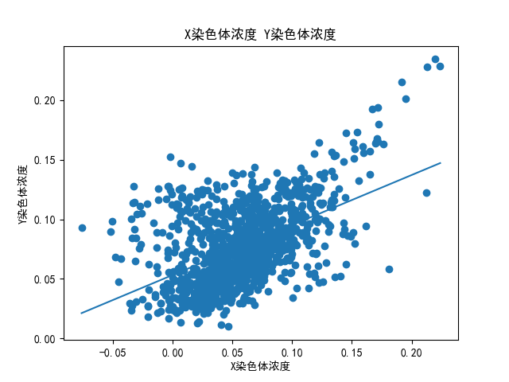

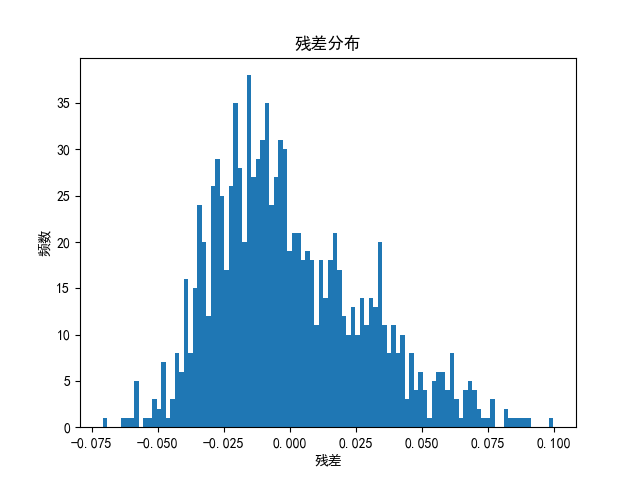

###### 2.2.2.2.2 多元线性回归分析

试探性对所有高相关度的变量进行多元线性回归分析。编写Multiple_Linear_Regression.py，绘制多元线性回归分析后的实际值和预测值图像，绘制残差和预测值图像，绘制残差分布直方图。容易看出，回归模型较前一个模型有了改进，但同样尚未完全刻画散点图右上方的一部分数据，残差未均匀分布在预测值线两端而是形成一个聚类和较多散点，残差分布也呈现偏态分布，说明该回归模型欠佳。该模型的回归方程为

$Y染色体浓度=0.25402506719670254+0.42061230195294236×X染色体浓度-0.002796962816689941×18号染色体的Z值-0.17859788147961936×在参考基因组上比对的比例-0.0014507217072837367×孕妇BMI-0.0008636357510604348×年龄+0.004752241009179127×Y染色体的Z值+0.47160333440177454×重复读段的比例$

$R^2$为$0.34312687364128214$

残差平方和$Q=0.7960362447383946$

对残差进行Shapiro-Wilk正态性检验，$p$值为$6.677008135804969e-13$

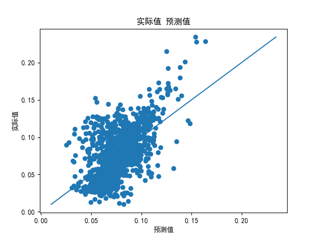


###### 2.2.2.2.3 单元二次回归分析

试探性对相关度最高的X染色体浓度和Y染色体浓度进行单元二次回归分析。编写Quadratic_Regression.py，绘制多元线性回归分析后的回归方程和两个数据组的散点图，绘制残差和预测值图像，绘制残差分布直方图。容易看出，回归方程勉强刻画散点图数据，残差勉强均匀分布在预测值线两端，在低预测值形成聚类，随预测值增高而收缩到预测值线上，伴随较多散点，残差分布勉强呈现正态分布，说明该回归模型尚佳。该模型的回归方程为

$y=0.061466040681887206-0.0005399112319373662x+3.177077168400777x^2$

$R^2$为$0.33863605795376284$

残差平方和$Q=0.8014784708125864$

对残差进行Shapiro-Wilk正态性检验，$p值为$9.110891881921818e-08$


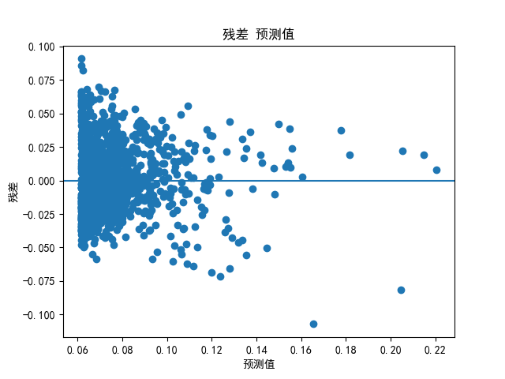


###### 2.2.2.2.4 多元二次回归分析

试探性对所有高相关度的变量进行多元线性回归分析。编写Multiple_Quadratic_Regression.py，绘制多元线性回归分析后的实际值和预测值图像，绘制残差和预测值图像，绘制残差分布直方图。容易看出，回归方程较好刻画散点图数据，残差勉强均匀分布在预测值线两端，在中预测值形成聚类，伴随较多散点，残差分布勉强呈现正态分布，说明该回归模型尚佳。该模型的回归方程为

$Y染色体浓度=-0.5024156241160272-0.030267864052407483×X染色体浓度+3.2470207051101454×X染色体浓度²-0.0026080436818529374×18号染色体的Z值+3.701795289954249e-05×18号染色体的Z值²+1.4636015690960296×在参考基因组上比对的比例-1.0410889914073274×在参考基因组上比对的比例²+0.0050123975969338114×孕妇BMI-9.512575206047174e-05×孕妇BMI²$

$R^2$为$0.37253638122007215$

残差平方和$Q=0.7603961294205388$

对残差进行Shapiro-Wilk正态性检验，$p$值为$4.405794011644701e-08$


###### 2.2.2.2.5 单元三次回归分析

试探性对相关度最高的X染色体浓度和Y染色体浓度进行单元三次回归分析。编写Cubic_Regression.py，绘制多元线性回归分析后的回归方程和两个数据组的散点图，绘制残差和预测值图像，绘制残差分布直方图。容易看出，回归方程勉强刻画散点图数据，残差勉强均匀分布在预测值线两端，在低预测值形成聚类，随预测值增高而收缩到预测值线上，伴随较多散点，残差分布勉强呈现正态分布，说明该回归模型尚佳。该模型的回归方程为

$y=0.06124121781711486-0.07082437162204913x+4.771080090841863x^2-7.233018277421364x^3$

$R^2$为$0.34092273763942493$

残差平方和$Q=0.7987073422082169$

对残差进行Shapiro-Wilk正态性检验，$p$值为$8.432402942645808e-08$

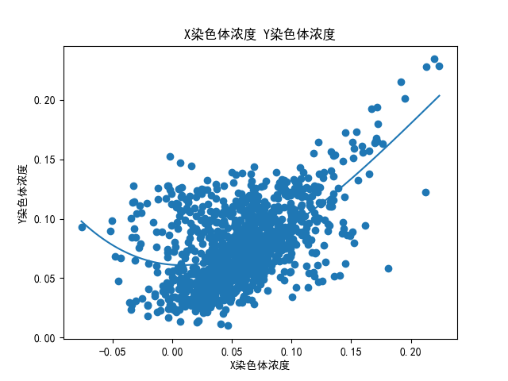
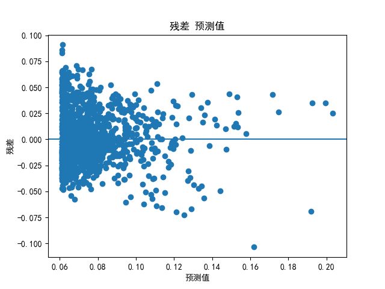


##### 2.2.2.3 模型选择

在尝试了从单元到多元、从线性到三次的多种回归模型后，通过比较发现，多元二次回归分析在决定系数 $R^2$ 与残差正态性检验的$p$值上均表现最佳，残差平方和最小。这表明该模型具有更好的拟合优度，且残差服从正态分布，满足模型假设。因此，最终选用多元二次回归方程作为描述变量间关系的模型。

## 3 问题2模型的建立与求解

### 3.1 问题分析与描述

问题2旨在依据BMI对男胎孕妇进行合理分组，并通过分析各组内Y染色体浓度随孕周的变化，确定其达到有效阈值（$≥0.04$）的最佳检测时点，以最小化因检测过早或过晚带来的潜在风险。在此基础上，进一步评估检测误差对各组最佳时点判定结果的影响。

### 3.2 基于聚类的NIPT时点选择模型的建立

#### 3.2.1 模型预处理

基于孕妇BMI与Y染色体浓度的散点图观察，数据呈现明显的聚类特征与若干离群分布点。为此，首先采用经验分类法，将数据大致划分为密集聚类区与离散点区。进一步，为更客观地对数据进行分组，引入K-Means聚类算法，以BMI作为特征进行聚类划分[4]。

为确定各组的最佳NIPT检测时点，筛选出各组内Y染色体浓度处于有效窗口（$[0.04,0.1]$）的样本，并计算其对应孕周的平均值，以此作为该组的最佳检测时点。

#### 3.2.2 模型建立

在实现孕妇BMI与Y染色体浓度数据的分类分析时，编写K-Means.py。首先，基于散点图观察，采用经验分类法将数据按BMI划分为三个区间：$[20,25)$、$[25,42)$和$[42,50]$。针对每个区间，筛选出Y染色体浓度位于有效窗口$[0.04,0.1]$的样本，计算其对应孕周的平均值，以此作为该经验分组下的最佳NIPT检测时点。

进一步，为实现更客观的数据划分，采用K-Means聚类算法。通过调试不同的K值进行比较，发现当$K=6$时，算法能有效识别核心聚类并分离离散点，达到较理想的分类效果。因此，最终确定聚类个数为$6$。随后，同样针对每个簇内Y染色体浓度达标的样本，计算其平均孕周作为该簇的最佳检测时点，同时记录各簇对应的BMI范围。基于此，得到了基于聚类分析的样本空间分组及其最佳NIPT时点结果，如下。

朴素分组分析

各BMI分组中Y染色体浓度在0.04-0.1范围内的检测孕周平均值:

组1(BMI 20-25):19.714285715000003周

组2(BMI 25-42):16.60857567384844周

组3(BMI 42-50):20.971428572周

KMeans聚类分析

特征:孕妇BMI

各聚类中Y染色体浓度在0.04-0.1范围内的检测孕周平均值:

聚类1:15.877213695537192周

聚类2:18.14160400964912周

聚类3:15.934381407751196周

聚类4:18.059523809999998周

聚类5:16.80680272114286周

聚类6:19.714285715000003周

各聚类BMI区间:

聚类1:BMI范围[26.61934339,29.89969136]

聚类2:BMI范围[34.44960743,37.8328742]

聚类3:BMI范围[31.99217133,34.42815484]

聚类4:BMI范围[38.22222222,46.875]

聚类5:BMI范围[29.92827414,31.96734694]

聚类6:BMI范围[20.703125,20.703125]

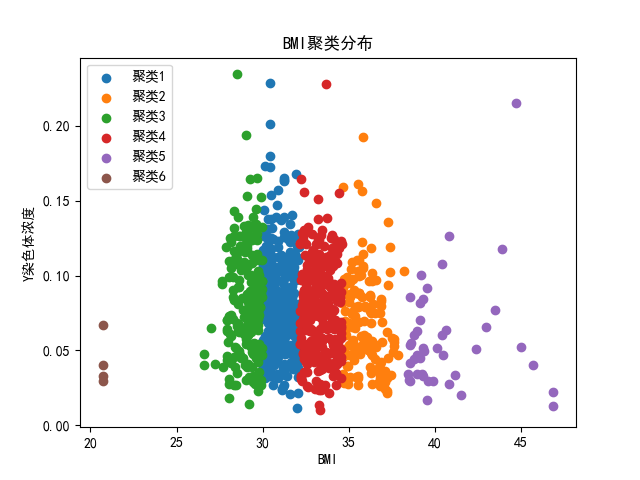

需要特别说明的是，K-Means聚类算法给出的结果并不唯一。所以以上图像的聚类划分不是唯一的，BMI范围也不是唯一的。

## 4 问题3模型的建立与求解

### 4.1 问题分析与描述

问题3在问题2的基础上，进一步引入身高、体重、年龄等多维影响因素，并结合检测误差分析，构建更精细的分组模型。通过多维聚类方法对孕妇进行重新分类，并优化各组的最佳NIPT检测时点，以更有效地降低因检测时机不当带来的潜在风险。

### 4.2 基于聚类的NIPT时点选择模型的建立

#### 4.2.1 模型预处理

在综合考虑多种因素的情况下，这里将扩展上一问题到多维特征空间，构建更精细的孕妇分组模型。基于斯皮尔曼相关性分析结果，选择了与Y染色体浓度具有显著相关性的四个关键指标作为聚类特征：X染色体浓度、18号染色体的Z值、在参考基因组上比对的比例以及孕妇BMI。这些变量在相关性检验中均表现出较高的显著性，能够有效刻画Y染色体浓度变化的内在关联。

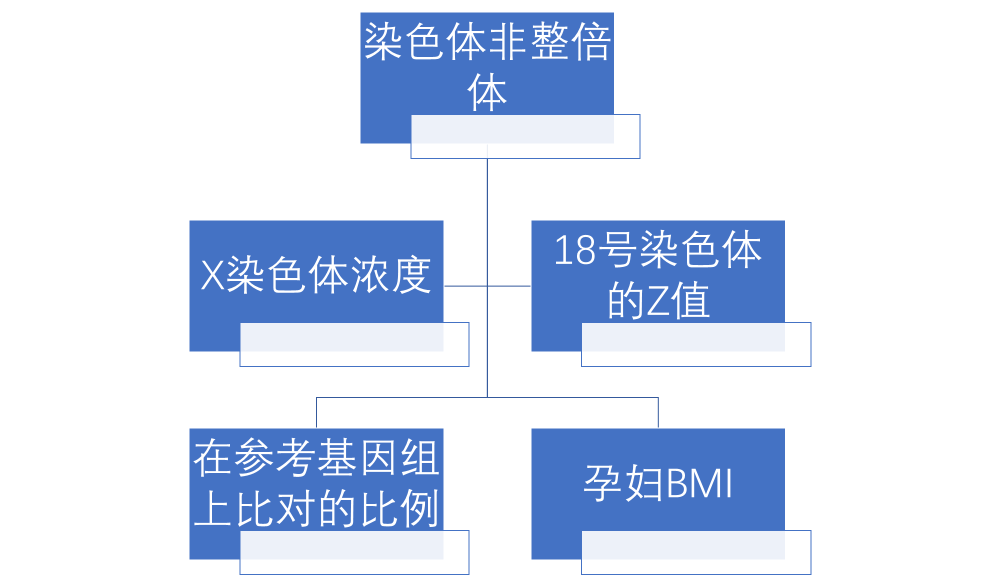

首先对上述四个特征变量进行标准化处理，消除量纲影响。考虑到多个特征维度下数据分布的非线性特性，采用K-Means算法进行多维聚类分析，而非经验分类，实现对孕妇样本的高维空间划分。

为确定各组的最佳NIPT检测时点，在聚类划分的基础上，筛选各组内Y染色体浓度处于有效检测窗口（$[0.04,0.1]$）的样本，计算其对应孕周的平均值。

#### 4.2.2 模型建立

在实现孕妇BMI与其他多种因素与Y染色体浓度数据的分类分析时，编写Multiple_K-Means.py，实现多维K-Means聚类算法。为保持问题前后一致性，选择聚类数$K=6$。随后，同样针对每个簇内Y染色体浓度达标的样本，计算其平均孕周作为该簇的最佳检测时点，同时记录各簇对应的BMI范围。基于此，得到了基于聚类分析的样本空间分组及其最佳NIPT时点结果，如下。

多维KMeans聚类分析

特征:X染色体浓度、18号染色体的Z值、在参考基因组上比对的比例、孕妇BMI

各聚类中Y染色体浓度在0.04-0.1范围内的检测孕周平均值:

聚类1:19.1304347826087周

聚类2:16.48179271676471周

聚类3:17.48113207537736周

聚类4:16.922779922837833周

聚类5:15.427678571249999周

聚类6:16.254437869822485周

各聚类BMI区间:

聚类1:BMI范围[27.63980131,36.88888889]

聚类2:BMI范围[28.06493149,37.29068808]

聚类3:BMI范围[33.54553569,46.875]

聚类4:BMI范围[27.88134285,40.83044983]

聚类5:BMI范围[27.97521095,36.5777241]

聚类6:BMI范围[20.703125,33.77493128]

## 5 问题4模型的建立与求解

### 5.1 问题分析与描述 

问题4针对女胎染色体异常的判定问题，由于无法依赖Y染色体浓度作为判断依据，需建立以21号、18号及13号染色体非整倍体状态为判别目标的分类模型。需综合考虑X染色体及上述目标染色体的Z值、GC含量、读段数及其衍生比例，并结合孕妇BMI等多维度特征，构建一套可靠的女胎染色体异常判定方法。据此，可以建立基于随机森林的判定模型[4]，对结果实现二分类的判定。

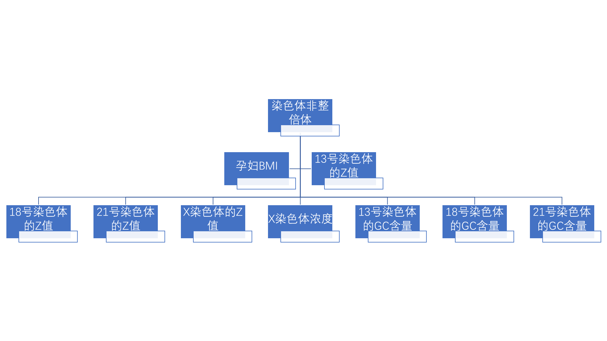

### 5.2 基于随机森林的胎儿的异常判定模型的建立

#### 5.2.1 模型预处理

从Excel从附件.xlsx导出女胎检测数据.csv。对于随机森林模型的建立，通常将所给数据组分为两部分，一部分作为训练数据，一部分作为检验数据，以防止全部数据组都用做训练数据出现的问题。这里按照惯例将数据组前80%的数据作为训练数据，后20%的数据作为检验数据，放入随机森林模型进行训练和检验。

根据附录2，Z值的计算公式定义为：

$Z=(X-\mu)/\sigma$
 
其中，$X$表示待测样本中目标染色体的相对计数比例，$\mu$为正常对照群体中该染色体计数比例的均值，$\sigma$为其标准差。Z值的统计学意义在于，它定量刻画了该样本与正常群体均值之间相差的标准差个数。

在正态分布假设下，可依据“3σ原则”进行判别：约有99.73%的数据落在均值$±3$个标准差范围内。因此，若某样本的Z值绝对值超过$3$，表明其已处于正态分布的极端尾部，属于统计学上的严重离群值。在产前检测中，Z值的显著离群（$|Z|>3$）是提示胎儿染色体异常的关键指标之一。

#### 5.2.2 模型建立

编写随机森林分类程序（Random_Forest_Classifier.py），以构建女胎染色体异常判定模型。模型的输入特征包括：13号、18号、21号及X染色体的Z值、X染色体浓度，以及13号、18号、21号染色体的GC含量。输出变量为染色体非整倍体状态（若对应数据为空则标记为健康，否则为异常）。该模型不仅可输出在测试集上的分类准确率，还能评估各输入特征的重要性。运行结果显示，模型在测试集上的准确率达到90.08%，输出结果如下。

正常样本数(y=0):538

异常样本数(y=1):67

训练集大小:484

测试集大小:121

测试集准确率:0.9008264462809917

特征重要性

列10:0.08025442058711352

列16:0.0981655324644796

列17:0.082084479587055

列18:0.08553333907305731

列19:0.07081562577933803

列22:0.22629905184517254

列23:0.13963217291243957

列24:0.10819249086624183

列25:0.10902288688510256

上述结果表明，随机森林模型具有较好的拟合性能。为进一步验证模型稳定性，将决策树数量从$100$棵逐步调整至$1000$棵，准确率保持不变。这一定程度上说明模型已充分学习了数据特征，达到了当前特征下的最高分类性能。

随机森林模型的特征重要性分析显示，对应13号、18号、21号及X染色体Z值的特征（第16到第19列）权重显著较高。这一结果进一步印证了Z值在胎儿染色体异常判读中的关键作用。


## 6 模型的评价

对于问题1的模型，仍停留在拟合和探索阶段。当前模型仅考虑变量的独立影响，未探索变量间的交互效应（如BMI与孕周的交互项），可能遗漏重要预测信息。并且多元二次回归虽优于其他尝试，但可能无法捕捉更复杂的非线性模式。可考虑引入高阶交互项或采用更灵活的回归方法（如样条回归、支持向量回归等）以提高拟合能力。

对于问题2和问题3的模型，第一，未量化检测误差对最佳时点估计的影响，缺乏对结果稳健性的评估。第二，第二，“使得孕妇可能的潜在风险最小”可能是一个优化问题，旨在获得区间NIPT最佳时点和最高NIPT准确率，聚类算法可能是一个错误的选择。第三，直接取浓度达标样本的孕周均值作为最佳时点，未考虑浓度随孕周的连续变化规律，选择过于片面、刻意。据此，可以考虑重新对问题进行建模，从优化问题的角度进行思考，建立决策变量——目标函数——约束条件的求解链条。

对于问题4的模型，可能存在类型不平衡，即数据中健康与异常样本比例可能失衡，影响模型对少数类的识别性能。且模型只采用原始特征，没有尝试分析所给数据集之间的相互影响，这也有可能成为特征。随机森林的模型解释性也有限，“黑箱”特性使得难以理解具体决策逻辑，不利于临床解释。同时仅使用单一数据集划分验证，缺乏独立外部数据集的验证，模型泛化能力存疑。改进可以从外部数据检验入手。

## 7 参考文献

[1] PIANTADOSI J, HOWLETT P, BOLAND J. Matching the grade correlation coefficient using a copula with maximum disorder[J]. Journal of Industrial and Management Optimization, 2007, 3(2): 305-312.

[2] 程琮，刘一志，王如德. Kendall协调系数W检验及其SPSS实现[J]. 泰山医学院学报，2010，31（7）：487-490.

[3] 杨俊闯，赵超. K-Means聚类算法研究综述[J]. 计算机工程与应用，2019，55（23）：7-14.

[4] 方匡南，吴见彬，朱建平，谢邦昌. 随机森林方法研究综述[J]. 统计与信息论坛，2011，26(3)：32-38.

## 8 附录

Shapiro-Wilk.py

```
import pandas as pd
from scipy import stats

df = pd.read_csv('男胎检测数据.csv',encoding='gbk')

columns_to_test = \
{
    2: "年龄",
    3: "身高",
    4: "体重",
    10: "检测孕周",
    11: "孕妇BMI",
    12: "原始读段数",
    13: "在参考基因组上比对的比例",
    14: "重复读段的比例",
    15: "唯一比对的读段数",
    16: "GC含量",
    17: "13号染色体的Z值",
    18: "18号染色体的Z值",
    19: "21号染色体的Z值",
    20: "X染色体的Z值",
    21: "Y染色体的Z值",
    22: "Y染色体浓度",
    23: "X染色体浓度",
    24: "13号染色体的GC含量",
    25: "18号染色体的GC含量",
    26: "21号染色体的GC含量",
    27: "被过滤掉读段数的比例"
}

print("Shapiro-Wilk正态性检验结果:\n")

for col_idx, col_name in columns_to_test.items():
    data = df.iloc[1:1082, col_idx]

    stat, p_value = stats.shapiro(data)

    alpha = 0.05
    if p_value > alpha:
        result = "符合正态分布"
    else:
        result = "不符合正态分布"

    print(f"{col_name},p值:{p_value},{result}\n")
```

Spearman.py

```
import pandas as pd
from scipy import stats
import numpy as np

df = pd.read_csv('男胎检测数据.csv', encoding='gbk')

columns_to_test = \
{
    2: "年龄",
    3: "身高",
    4: "体重",
    10: "检测孕周",
    11: "孕妇BMI",
    12: "原始读段数",
    13: "在参考基因组上比对的比例",
    14: "重复读段的比例",
    15: "唯一比对的读段数",
    16: "GC含量",
    17: "13号染色体的Z值",
    18: "18号染色体的Z值",
    19: "21号染色体的Z值",
    20: "X染色体的Z值",
    21: "Y染色体的Z值",
    22: "Y染色体浓度",
    23: "X染色体浓度",
    24: "13号染色体的GC含量",
    25: "18号染色体的GC含量",
    26: "21号染色体的GC含量",
    27: "被过滤掉读段数的比例"
}

y_concentration = []
for i in range(1, 1082):
    val = df.iloc[i, 22]
    y_concentration.append(float(val))

y_array = np.array(y_concentration)

print("各变量与Y染色体浓度的斯佩尔曼相关性分析:\n")

results = []

for col_idx, col_name in columns_to_test.items():
    if col_idx == 22:
        continue

    data = []
    for i in range(1, 1082):
        val = df.iloc[i, col_idx]
        data.append(float(val))

    x_array = np.array(data)

    valid_pairs = []
    for x, y in zip(x_array, y_array):
        if not np.isnan(x) and not np.isnan(y):
            valid_pairs.append((x, y))

    x_vals = [p[0] for p in valid_pairs]
    y_vals = [p[1] for p in valid_pairs]

    rho, p_value = stats.spearmanr(x_vals, y_vals)

    if p_value < 0.001:
        sig = "3"
    elif p_value < 0.01:
        sig = "2"
    elif p_value < 0.05:
        sig = "1"
    else:
        sig = "0"

    results.append((col_name, rho, p_value, len(valid_pairs), sig))

results.sort(key=lambda x: abs(x[1]) if x[1] != "N/A" else -1, reverse=True)

for col_name, rho, p_value, n, sig in results:
    print(f"{col_name},p值:{p_value},{sig}\n")
```

Linear_Regression.py

```
import pandas as pd
import numpy as np
import statsmodels.api as sm
import matplotlib.pyplot as plt

plt.rcParams['font.sans-serif'] = ['SimHei']
plt.rcParams['axes.unicode_minus'] = False

df = pd.read_csv('男胎检测数据.csv', encoding='gbk')

X_chr_data = []
Y_chr_data = []

for i in range(1, 1082):
    X_chr_data.append(float(df.iloc[i, 23]))
    Y_chr_data.append(float(df.iloc[i, 22]))

X_chr = np.array(X_chr_data)
Y_chr = np.array(Y_chr_data)

print("单元线性回归分析:X染色体浓度 Y染色体浓度")

X1 = sm.add_constant(X_chr)
model1 = sm.OLS(Y_chr, X1).fit()
print(model1.summary())

Y_pred = model1.predict(X1)
residuals = Y_chr - Y_pred

Q = np.sum(residuals**2)

print(f"回归方程:y={model1.params[0]:}+{model1.params[1]:}x")
print(f"R²={model1.rsquared:}")
print(f"Q={Q}")

plt.scatter(X_chr, Y_chr)
x_line = np.linspace(X_chr.min(), X_chr.max())
y_line1 = model1.params[0] + model1.params[1] * x_line
plt.plot(x_line, y_line1)
plt.xlabel('X染色体浓度')
plt.ylabel('Y染色体浓度')
plt.title('X染色体浓度 Y染色体浓度')
plt.savefig('单元线性回归分析 X染色体浓度 Y染色体浓度.png')
plt.show()

plt.scatter(Y_pred, residuals)
plt.axhline(y=0)
plt.xlabel('预测值')
plt.ylabel('残差')
plt.title('残差 预测值')
plt.savefig('单元线性回归分析 残差 预测值.png')
plt.show()

plt.hist(residuals, bins=100)
plt.xlabel('残差')
plt.ylabel('频数')
plt.title('残差分布')
plt.savefig('单元线性回归分析 残差分布.png')
plt.show()

from scipy import stats

shapiro_stat, shapiro_p = stats.shapiro(residuals)
print(f"Shapiro-Wilk检验p值:{shapiro_p}")
```

Mutiple_Linear_Regression.py

```
import pandas as pd
import numpy as np
import statsmodels.api as sm
import matplotlib.pyplot as plt

plt.rcParams['font.sans-serif'] = ['SimHei']
plt.rcParams['axes.unicode_minus'] = False

df = pd.read_csv('男胎检测数据.csv', encoding='gbk')

variables_data = {}
col_indices = \
{
    'X染色体浓度': 23,
    'Y染色体浓度': 22,
    '18号染色体的Z值': 18,
    '在参考基因组上比对的比例': 13,
    '孕妇BMI': 11,
    '年龄': 2,
    'Y染色体的Z值': 21,
    '重复读段的比例': 14
}

for var_name, col_idx in col_indices.items():
    data = []
    for i in range(1, 1082):
        data.append(float(df.iloc[i, col_idx]))
    variables_data[var_name] = np.array(data)

Y = variables_data['Y染色体浓度']

X_vars = ['X染色体浓度', '18号染色体的Z值', '在参考基因组上比对的比例', '孕妇BMI', '年龄', 'Y染色体的Z值', '重复读段的比例']

print("多元线性回归分析:X染色体浓度 18号染色体的Z值 在参考基因组上比对的比例 孕妇BMI 年龄 Y染色体的Z值 重复读段的比例 Y染色体浓度")

X = np.column_stack([variables_data[var] for var in X_vars])

X_with_const = sm.add_constant(X)

model = sm.OLS(Y, X_with_const).fit()

print(model.summary())

Y_pred = model.predict(X_with_const)
residuals = Y - Y_pred

SS_res = np.sum(residuals**2)
R2 = model.rsquared

print("回归方程:")
equation = f"Y染色体浓度={model.params[0]:}"
for i, var_name in enumerate(X_vars, 1):
    coef_sign = "+" if model.params[i] >= 0 else "-"
    equation += f"{coef_sign}{abs(model.params[i])}×{var_name}"
print(equation)

print(f"R²={R2}")
print(f"Q={SS_res}")

plt.scatter(Y_pred, Y)
plt.plot([Y.min(), Y.max()], [Y.min(), Y.max()])
plt.xlabel('预测值')
plt.ylabel('实际值')
plt.title('实际值 预测值')
plt.savefig('多元线性回归分析 实际值 预测值.png')
plt.show()

plt.scatter(Y_pred, residuals)
plt.axhline(y=0)
plt.xlabel('预测值')
plt.ylabel('残差')
plt.title('残差 预测值')
plt.savefig('多元线性回归分析 残差 预测值.png')
plt.show()

plt.hist(residuals, bins=100)
plt.xlabel('残差')
plt.ylabel('频数')
plt.title('残差分布')
plt.savefig('多元线性回归分析 残差分布.png')
plt.show()

from scipy import stats

shapiro_stat, shapiro_p = stats.shapiro(residuals)
print(f"Shapiro-Wilk检验统计量:p值:{shapiro_p}")
```

Quadratic_Regression.py

```
import pandas as pd
import numpy as np
import statsmodels.api as sm
import matplotlib.pyplot as plt

plt.rcParams['font.sans-serif'] = ['SimHei']
plt.rcParams['axes.unicode_minus'] = False

df = pd.read_csv('男胎检测数据.csv', encoding='gbk')

X_chr_data = []
Y_chr_data = []

for i in range(1, 1082):
    X_chr_data.append(float(df.iloc[i, 23]))
    Y_chr_data.append(float(df.iloc[i, 22]))

X_chr = np.array(X_chr_data)
Y_chr = np.array(Y_chr_data)

print("单元二次回归分析:X染色体浓度 Y染色体浓度")

X_poly = np.column_stack([np.ones(len(X_chr)), X_chr, X_chr**2])

model_poly = sm.OLS(Y_chr, X_poly).fit()

print(model_poly.summary())

Y_pred = model_poly.predict(X_poly)
residuals = Y_chr - Y_pred

SS_res = np.sum(residuals**2)
R2 = model_poly.rsquared

print("回归方程:")
equation = f"y={model_poly.params[0]:}"

var_names_poly = ['x', 'x²']

for i, var_name in enumerate(var_names_poly, 1):
    coef_sign = "+" if model_poly.params[i] >= 0 else "-"
    equation += f"{coef_sign}{abs(model_poly.params[i])}{var_name}"

print(equation)

print(f"R²={R2}")
print(f"Q={SS_res}")

plt.scatter(X_chr, Y_chr)
x_line = np.linspace(X_chr.min(), X_chr.max(), 100)
x_line_design = np.column_stack([np.ones(100), x_line, x_line**2])
y_line_poly = model_poly.predict(x_line_design)
plt.plot(x_line, y_line_poly)
plt.xlabel('X染色体浓度')
plt.ylabel('Y染色体浓度')
plt.title('X染色体浓度 Y染色体浓度')
plt.savefig('单元二次回归分析 X染色体浓度 Y染色体浓度.png')
plt.show()

plt.scatter(Y_pred, residuals)
plt.axhline(y=0)
plt.xlabel('预测值')
plt.ylabel('残差')
plt.title('残差 预测值')
plt.savefig('单元二次回归分析 残差 预测值.png')
plt.show()

plt.hist(residuals, bins=100)
plt.xlabel('残差')
plt.ylabel('频数')
plt.title('残差分布')
plt.savefig('单元二次回归分析 残差分布.png')
plt.show()

from scipy import stats

shapiro_stat, shapiro_p = stats.shapiro(residuals)
print(f"Shapiro-Wilk检验p值:{shapiro_p}")
```

Multiple_Quadratic_Regression.py

```
import pandas as pd
import numpy as np
import statsmodels.api as sm
import matplotlib.pyplot as plt

plt.rcParams['font.sans-serif'] = ['SimHei']
plt.rcParams['axes.unicode_minus'] = False

df = pd.read_csv('男胎检测数据.csv', encoding='gbk')

X_vars_data = {}
col_indices = \
{
    'X染色体浓度': 23,
    '18号染色体的Z值': 18,
    '在参考基因组上比对的比例': 13,
    '孕妇BMI': 11,
    'Y染色体浓度': 22
}

for var_name, col_idx in col_indices.items():
    data = []
    for i in range(1, 1082):
        data.append(float(df.iloc[i, col_idx]))
    X_vars_data[var_name] = np.array(data)

Y = X_vars_data['Y染色体浓度']

selected_vars = ['X染色体浓度', '18号染色体的Z值', '在参考基因组上比对的比例', '孕妇BMI']

print("多元二次回归分析:X染色体浓度 18号染色体的Z值 在参考基因组上比对的比例 孕妇BMI Y染色体浓度")

X_matrix = np.ones(len(Y))

var_names = []

for var_name in selected_vars:
    X_matrix = np.column_stack([X_matrix, X_vars_data[var_name]])
    var_names.append(var_name)

    X_matrix = np.column_stack([X_matrix, X_vars_data[var_name] ** 2])
    var_names.append(f'{var_name}²')

model_poly = sm.OLS(Y, X_matrix).fit()

print(model_poly.summary())

Y_pred = model_poly.predict(X_matrix)
residuals = Y - Y_pred

SS_res = np.sum(residuals ** 2)
R2 = model_poly.rsquared

print("回归方程:")
equation = f"Y染色体浓度={model_poly.params[0]:}"

for i, var_name in enumerate(var_names, 1):
    coef_sign = "+" if model_poly.params[i] >= 0 else "-"
    equation += f"{coef_sign}{abs(model_poly.params[i])}{var_name}"

print(equation)

print(f"R²={R2}")
print(f"Q={SS_res}")

plt.scatter(Y_pred, Y)
plt.plot([Y.min(), Y.max()], [Y.min(), Y.max()])
plt.xlabel('预测值')
plt.ylabel('实际值')
plt.title('实际值 预测值')
plt.savefig('多元二次回归分析 实际值 预测值.png')
plt.show()

plt.scatter(Y_pred, residuals)
plt.axhline(y=0)
plt.xlabel('预测值')
plt.ylabel('残差')
plt.title('残差 预测值')
plt.savefig('多元二次回归分析 残差 预测值.png')
plt.show()

plt.hist(residuals, bins=100)
plt.xlabel('残差')
plt.ylabel('频数')
plt.title('残差分布')
plt.savefig('多元二次回归分析 残差分布.png')
plt.show()

from scipy import stats

shapiro_stat, shapiro_p = stats.shapiro(residuals)
print(f"Shapiro-Wilk检验p值:{shapiro_p}")
```

Cubic_Regression.py

```
import pandas as pd
import numpy as np
import statsmodels.api as sm
import matplotlib.pyplot as plt

plt.rcParams['font.sans-serif'] = ['SimHei']
plt.rcParams['axes.unicode_minus'] = False

df = pd.read_csv('男胎检测数据.csv', encoding='gbk')

X_chr_data = []
Y_chr_data = []

for i in range(1, 1082):
    X_chr_data.append(float(df.iloc[i, 23]))
    Y_chr_data.append(float(df.iloc[i, 22]))

X_chr = np.array(X_chr_data)
Y_chr = np.array(Y_chr_data)

print("单元三次回归分析:X染色体浓度 Y染色体浓度")

X_poly = np.column_stack([np.ones(len(X_chr)), X_chr, X_chr**2, X_chr**3])

model_poly = sm.OLS(Y_chr, X_poly).fit()

print(model_poly.summary())

Y_pred = model_poly.predict(X_poly)
residuals = Y_chr - Y_pred

SS_res = np.sum(residuals**2)
R2 = model_poly.rsquared

print("回归方程:")
equation = f"y={model_poly.params[0]:}"

var_names_poly = ['x', 'x²', 'x³']

for i, var_name in enumerate(var_names_poly, 1):
    coef_sign = "+" if model_poly.params[i] >= 0 else "-"
    equation += f"{coef_sign}{abs(model_poly.params[i])}{var_name}"

print(equation)

print(f"R²={R2}")
print(f"Q={SS_res}")

plt.scatter(X_chr, Y_chr)
x_line = np.linspace(X_chr.min(), X_chr.max(), 100)
x_line_design = np.column_stack([np.ones(100), x_line, x_line**2, x_line**3])
y_line_poly = model_poly.predict(x_line_design)
plt.plot(x_line, y_line_poly)
plt.xlabel('X染色体浓度')
plt.ylabel('Y染色体浓度')
plt.title('X染色体浓度 Y染色体浓度')
plt.savefig('单元三次回归分析 X染色体浓度 Y染色体浓度.png')
plt.show()

plt.scatter(Y_pred, residuals)
plt.axhline(y=0)
plt.xlabel('预测值')
plt.ylabel('残差')
plt.title('残差 预测值')
plt.savefig('单元三次回归分析 残差 预测值.png')
plt.show()

plt.hist(residuals, bins=100)
plt.xlabel('残差')
plt.ylabel('频数')
plt.title('残差分布')
plt.savefig('单元三次回归分析 残差分布.png')
plt.show()

from scipy import stats

shapiro_stat, shapiro_p = stats.shapiro(residuals)
print(f"Shapiro-Wilk检验p值:{shapiro_p}")
```

K-Means.py

```
import pandas as pd
import numpy as np
from sklearn.cluster import KMeans
import matplotlib.pyplot as plt

plt.rcParams['font.sans-serif'] = ['SimHei']
plt.rcParams['axes.unicode_minus'] = False

df = pd.read_csv('男胎检测数据.csv', encoding='gbk')

data = df.iloc[1:1082]

bmi = data.iloc[:, 11].astype(float)
y_concentration = data.iloc[:, 22].astype(float)
weeks = data.iloc[:, 10].astype(float)

bmi_groups = \
[
    (20, 25),
    (25, 42),
    (42, 50)
]

print("朴素分组分析\n")
print("各BMI分组中Y染色体浓度在0.04-0.1范围内的检测孕周平均值:\n")

for i, (bmi_low, bmi_high) in enumerate(bmi_groups, 1):
    bmi_mask = (bmi >= bmi_low) & (bmi <= bmi_high)

    y_mask = (y_concentration >= 0.04) & (y_concentration <= 0.1)

    mask = bmi_mask & y_mask

    filtered_weeks = weeks[mask]

    if len(filtered_weeks) > 0:
        mean_week = filtered_weeks.mean()
        print(f"组{i}(BMI {bmi_low}-{bmi_high}):{mean_week}周\n")

X = bmi.values.reshape(-1, 1)

kmeans = KMeans(n_clusters=6)
clusters = kmeans.fit_predict(X)

data_copy = data.copy()
data_copy['BMI'] = bmi
data_copy['Y染色体浓度'] = y_concentration
data_copy['检测孕周'] = weeks
data_copy['cluster'] = clusters

import matplotlib.pyplot as plt
for cluster_id in range(6):
    cluster_data = data_copy[data_copy['cluster'] == cluster_id]
    plt.scatter(cluster_data['BMI'], cluster_data['Y染色体浓度'], label=f'聚类{cluster_id+1}')

plt.xlabel('BMI')
plt.ylabel('Y染色体浓度')
plt.title('BMI聚类分布')
plt.legend()
plt.show()

print("KMeans聚类分析\n")
print("各聚类中Y染色体浓度在0.04-0.1范围内的检测孕周平均值:\n")
for cluster_id in range(6):
    cluster_data = data_copy[data_copy['cluster'] == cluster_id]

    filtered_data = cluster_data[(cluster_data['Y染色体浓度'] >= 0.04) & (cluster_data['Y染色体浓度'] <= 0.1)]

    if len(filtered_data) > 0:
        mean_week = filtered_data['检测孕周'].mean()
        print(f"聚类{cluster_id+1}:{mean_week}周\n")

print("各聚类BMI区间:\n")
for cluster_id in range(6):
    cluster_data = data_copy[data_copy['cluster'] == cluster_id]
    min_bmi = cluster_data['BMI'].min()
    max_bmi = cluster_data['BMI'].max()
    print(f"聚类{cluster_id+1}:BMI范围[{min_bmi},{max_bmi}]\n")
```

Multiple_K-Means.py

```
import pandas as pd
import numpy as np
from sklearn.cluster import KMeans
from sklearn.preprocessing import StandardScaler

df = pd.read_csv('男胎检测数据.csv', encoding='gbk')

data = df.iloc[1:1082]

bmi = data.iloc[:, 11].astype(float)
y_concentration = data.iloc[:, 22].astype(float)
weeks = data.iloc[:, 10].astype(float)

x_concentration = data.iloc[:, 23].astype(float)
z_18 = data.iloc[:, 18].astype(float)
alignment_ratio = data.iloc[:, 13].astype(float)

features_df = pd.DataFrame({
    'X染色体浓度': x_concentration,
    '18号染色体Z值': z_18,
    '比对比例': alignment_ratio,
    'BMI': bmi,
    'Y染色体浓度': y_concentration,
    '检测孕周': weeks
})

X_multi = features_df[['X染色体浓度', '18号染色体Z值', '比对比例', 'BMI']].values

scaler = StandardScaler()
X_multi_scaled = scaler.fit_transform(X_multi)

kmeans_multi = KMeans(n_clusters=6, random_state=42, n_init=10)
clusters_multi = kmeans_multi.fit_predict(X_multi_scaled)

features_df['cluster_multi'] = clusters_multi

print("多维KMeans聚类分析\n")
print("特征:X染色体浓度、18号染色体的Z值、在参考基因组上比对的比例、孕妇BMI\n")
print("各聚类中Y染色体浓度在0.04-0.1范围内的检测孕周平均值:\n")

for cluster_id in range(6):
    cluster_data = features_df[features_df['cluster_multi'] == cluster_id]

    filtered_data = cluster_data[
        (cluster_data['Y染色体浓度'] >= 0.04) &
        (cluster_data['Y染色体浓度'] <= 0.1)
        ]

    if len(filtered_data) > 0:
        mean_week = filtered_data['检测孕周'].mean()
        print(f"聚类{cluster_id + 1}:{mean_week}周\n")

print("各聚类BMI区间:\n")
for cluster_id in range(6):
    cluster_data = features_df[features_df['cluster_multi'] == cluster_id]
    min_bmi = cluster_data['BMI'].min()
    max_bmi = cluster_data['BMI'].max()
    print(f"聚类{cluster_id + 1}: BMI范围[{min_bmi}, {max_bmi}]\n")
```

Random_Forest_Classifier.py.py

```
import pandas as pd
import numpy as np
import matplotlib.pyplot as plt
from sklearn.model_selection import train_test_split
from sklearn.ensemble import RandomForestClassifier
from sklearn.metrics import accuracy_score

plt.rcParams['font.sans-serif'] = ['SimHei']
plt.rcParams['axes.unicode_minus'] = False

df = pd.read_csv('女胎检测数据.csv', header=0, encoding="gbk")

feature_columns = [10, 16, 17, 18, 19, 22, 23, 24, 25]
X = df.iloc[0:605, feature_columns]

y = df.iloc[0:605, 27]

y = y.notna().astype(int)

print(f"正常样本数(y=0):{(y==0).sum()}\n")
print(f"异常样本数(y=1):{(y==1).sum()}\n")

X_train, X_test, y_train, y_test = train_test_split(X, y, test_size=0.2, random_state=42)

print(f"训练集大小:{X_train.shape[0]}\n")
print(f"测试集大小:{X_test.shape[0]}\n")

model = RandomForestClassifier(n_estimators=1000)

model.fit(X_train, y_train)

y_pred = model.predict(X_test)

accuracy = accuracy_score(y_test, y_pred)
print(f"测试集准确率:{accuracy}\n")

feature_names = [f"列{col}" for col in feature_columns]
print(f"特征重要性\n")
for name, importance in zip(feature_names, model.feature_importances_):
    print(f"{name}:{importance}\n")

#for i in range(len(X_test)):
#    true_label = "正常" if y_test.iloc[i] == 0 else "异常"
#    pred_label = "正常" if y_pred[i] == 0 else "异常"
#    print(f"样本{i+1}:真实={true_label},预测={pred_label}\n")

correct_predictions = (y_pred == y_test).astype(int)

colors = ['red' if cp == 0 else 'green' for cp in correct_predictions]

plt.scatter(range(len(y_test)), correct_predictions, c=colors)

plt.xlabel('测试样本序号')
plt.ylabel('预测结果')
plt.title(f'随机森林模型预测结果(准确率:{accuracy})')
plt.yticks([0, 1], ['预测错误', '预测正确'])

from matplotlib.patches import Patch

legend_elements = \
[
    Patch(facecolor='green', label='预测正确'),
    Patch(facecolor='red', label='预测错误')
]
plt.legend(handles=legend_elements, loc='upper right')

plt.show()

plt.savefig('随机森林模型预测结果.png')
```